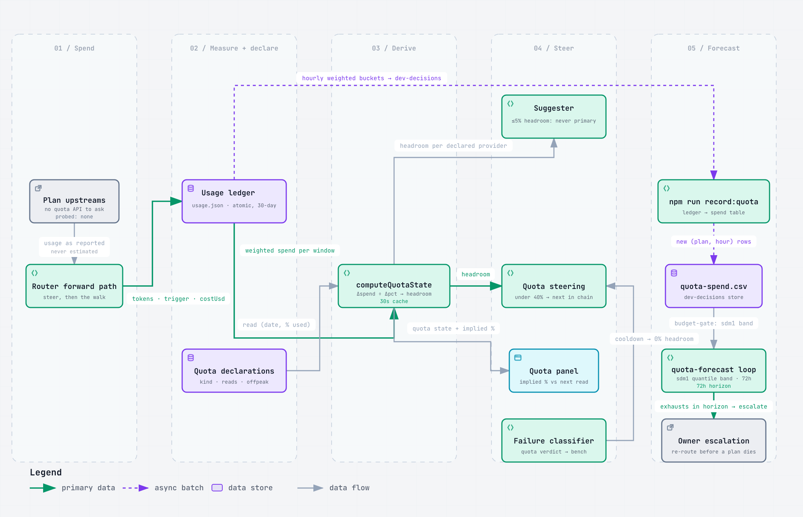
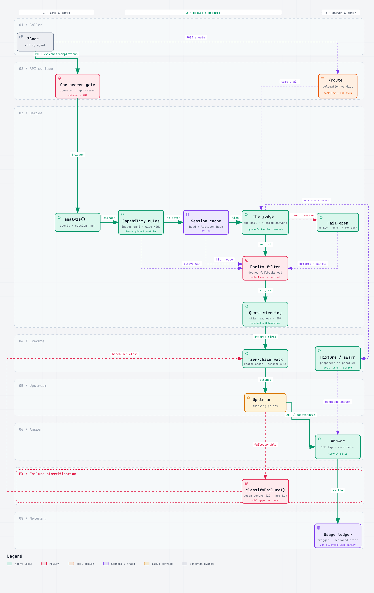

# zcode-router-kit

Installable, config-controlled model routing and workflow delegation for
[ZCode](https://github.com/zai-org/ZCode).

One roster file decides what a machine has; `kit apply` renders everything
ZCode reads. Clone the repo on a new machine, write its roster, set its keys,
and it comes up identical.

```
roster.json ──kit apply──┬── ~/.zcode/router/config.json       tier table, MoA, workflow registry
                         ├── ~/.zcode/v2/provider_config.json  the providers the model picker shows
                         ├── ~/.zcode/workflows/*.dwf.ts       the delegation library
                         ├── ~/.zcode/lib/workflow/*.mjs       the 16-module workflow plane
                         └── launchd / systemd service          keeps the router running
```

Requires Node ≥ 20 and nothing else — the CLI loads the plane too
(`lib/cli.mjs` imports it), and the plane declares `engines.node: ">=20"`, so
the whole kit inherits that floor. The router additionally needs
`@typesafe-ai/sdk` in its runtime dir (`~/.zcode/router`), the judge that picks
the workload, the execution style, and the workflow for every `auto` request.
`kit apply` ships both the plane's modules and the manifest that declares the
SDK, so only the SDK needs an `npm install --omit=dev` in that dir; `kit apply`
and `kit doctor` report it when it is missing.

**The workflow plane lives outside this repo.** `workflows/` here holds the
saved `.dwf.ts` files — the library. The engine that decomposes, builds,
coordinates and review-rounds them is a separate package, `workflow-plane`,
which lives in the engine checkout next to this one (`../agnostic-router-kit`
by convention). This repo resolves it as a `file:` dependency on that checkout
and `kit apply` ships its 16 modules beside the router at
`~/.zcode/lib/workflow/`, with a `node_modules/workflow-plane` link so the
shipped server's imports resolve inside the install. The engine edition is
where the plane is developed and versioned; this kit is one of its consumers.
Because the plane is resolved rather than copied, the kit cannot drift from the
engine — but the *installed* runtime beside the router can go stale silently, and
that is what the live service executes. `npm run check:port` asserts all three:
the resolution, the installed modules against the engine's, and that a module
in the installed router can resolve `workflow-plane/*.mjs`.

<p align="center">
  
  <br>
  <a href="docs/architecture/zcode-router-plane.html">The package boundary, interactive</a> —
  the engine edition's <code>workflow-plane</code>, the <code>file:</code>
  dependency this kit resolves, the roster / keys / workflow library you edit, what
  <code>kit apply</code> renders and installs, and the runtime it starts
</p>

## What you get

- **A model roster** — the plans this machine has (token plan, Step plan, MiMo
  plan, Z.AI coding plan, …), each with its endpoint, its models, and its key
  referenced by env-var name only. Keys live in `~/.zcode/router/.env`
  (chmod 600) and in ZCode's own provider config — never in the roster, never
  in git.
- **A workload tier table** — `quick` / `standard_code` / `hard` / `prose` /
  `deep_context`, each mapping a workload onto a concrete model, with ordered
  fallbacks. A machine missing a plan falls back to the next-best target
  instead of routing into a hole.
- **Pay-per-token safety** — a provider marked `billing: "payg"` can never be
  a routing target unless the roster explicitly sets `allowPayg: true`.
  Registering one for the picker is still allowed; billing it as the router's
  default is not.
- **Router-decided delegation** — the router (one TypeSafe judgment per task,
  cached) picks the workload, the execution style, and which saved workflows
  run, in what order. It answers three questions per task: run it as one call,
  as a **mixture of agents** (parallel proposers from different plan pools,
  judged, merged only when merging adds value), or as a **swarm** — a
  decomposed multi-agent run with review rounds, chosen from a library that
  includes swarm, adversarial-solve, bug-hunt, and review-sweep. The workflow
  registry is generated from the library's own `zcode-workflow` metadata
  blocks, so the library and the registry can never drift.
- **A workflow library** — the saved dynamic workflows in `workflows/`,
  installed into `~/.zcode/workflows/` without ever deleting files the user
  added locally, plus the engine they run on (`workflow-plane` — see above),
  installed beside the router. Two kinds of files live there: the `.dwf.ts`
  delegation workflows the router assigns, and the loop library — seven looped
  workflows (deep-research, triage, refine-loop, red-team, watchdog,
  remediate, router-eval) plus five zero-model-call probes — in which every
  flat judgment rides the dev-decisions/sys1 judge layer instead of a model
  call, and search credits are structurally unspendable by agents. Six
  tabular loops ride the dev-decisions lane: quota-forecast (per-plan
  exhaustion bands; an in-band crossing escalates), flake-watch (known-flaky
  suites named — quarantine, don't chase), calibrate-floors (proposed
  per-head confidence floors beside the static ones — proposes, never
  writes), risk-composed review (findings annotated with the revert risk of
  the directory they landed in), triage eval (sdm1 routing predictions
  journaled eval-only, never applied), and fleet-watch (watchdog runs flag
  repos deviating from fleet peers). Two more loops ride the semantic lane —
  dupe-watch and render-watch (see the semantic decisions bullet below) — one
  rides the diagram lane, diagram-refresh (see the diagram maintenance bullet
  below) — and three ride the media lane — asr-calibrate (the pinned ASR
  fixture graded per provider leg, the lane's promotion evidence),
  media-budget-watch (the daily telemetry cadence, ingested then forecast),
  and narrate (a script spoken to voice and gated against itself, advisory) —
  plus content-production's voice leg (see the media decisions bullet below):
  nineteen loops in all, carried in eighteen loop files (the fleet-watch
  section rides inside watchdog).
- **Local browsing & keyless-first search** — the plane's net legs are a
  ladder: the operator-installed moli browser renders pages locally first
  (`browserFetch` / `web_render`, the `browser` grant — default-off), a
  self-hosted Firecrawl (`FIRECRAWL_SCRAPE_URL`) is the scrape ladder's
  middle rung, and the plain bounded fetch is the floor; the journal's
  `via` names the leg that answered. Search is keyless-first — DuckDuckGo,
  `creditsUsed: 0` — with Firecrawl as the quality fallback reached only
  when DDG came up empty *and* the key actually resolves. moli is never
  bundled and never auto-downloaded; `kit doctor` reports the install. See
  [`docs/features/browsing.md`](docs/features/browsing.md).
- **Tabular decisions** — `world.tabular` execs the dev-decisions CLI's
  tabular lane over the tables the kit already produces (the usage ledger's
  hourly weighted spend, the probe outcomes `npm test` appends, git
  history) in dev-decisions' own store dir, behind the `tabular` grant
  (default-off). Batch-only by law: loops call it between rounds, never
  inside an ask — no TabPFN network call ever runs in a synchronous path.
  Fail-open by construction: absent CLI, absent sdm1 key (`TABPFN_API_KEY`),
  or an empty table → the loop reports the absence by name and proceeds
  exactly as today. See
  [`docs/features/tabular-decisions.md`](docs/features/tabular-decisions.md).
- **Semantic decisions** — `world.semantic` execs the dev-decisions CLI's
  embeddings lane (the `semantic` grant, default-off, batch-only) over the
  calibration store and named file corpora — geometry only: near-dupe pairs
  (dupe-watch: divergent grades escalate, agreeing pairs render merge
  proposals, nothing writes), unchanged re-render detection (render-watch, in
  shadow — nothing is skipped), repeat findings in review-sweep carrying their
  prior disposition (annotated, never dropped), and the router's shadow logger
  naming what the geometry would have picked beside the judge's actual pick.
  Embeddings propose, sys1/sdm1 dispose. See
  [`docs/features/semantic-lane.md`](docs/features/semantic-lane.md).
- **Media renders are generated, gated, and advisory.** `world.media(command, args)` execs the dev-decisions CLI's
  gen1 lane — text spoken to audio, a render transcribed and graded against the script that produced it, ASR
  calibrated against pinned fixtures, image renders, and the audio-seconds spend forecast — with `--json` injected on
  every call and the bridge reporting transport while each row carries its own verdict. Batch-only by law, like the
  lane before it: loops call it between rounds, never inside an ask. dev-decisions is the gate — this surface speaks
  its verbs and never a provider's API — every render is eval-only, and a media-gate verdict is advisory and never a
  block. Absent CLI (*"dev-decisions not installed — the media grant needs the dev-decisions CLI with gen1"*), a
  missing key (named by variable), or a thin table → the loop names the absence and proceeds exactly as today. See
  [`docs/features/media-lane.md`](docs/features/media-lane.md).
- **Diagram maintenance** — `world.diagram` keeps this kit's own archify
  diagrams (`docs/architecture/` — the plane, the request lifecycle, the
  quota, the architecture) honest after every code wave: every node carries
  source refs pinned to file, lines, and commit, and diagram-refresh audits
  them by byte-identity against the pin, re-pins the ones that purely moved,
  finalizes through the archify CLI, and renders the stills. The loop
  (`diagram` grant, default-off) anchors claims; authoring them stays with
  the agent, and the stills stay read by a human. See
  [`docs/features/diagram-lane.md`](docs/features/diagram-lane.md).
- **A run API** — `POST /v1/runs` on the kit's own wire lets an application
  spawn a workflow run under a per-app token whose `grantCeiling` bounds what
  it may request, answer the run's escalations while it is live, and collect
  its deliverable from the artifacts index. The operator token keeps its
  ceiling-free reach; an app token's blast radius is its ceiling and its
  sandbox, which is the point of ceilings.
- **A durable memory plane** — one JSONL graph on this machine (the engine
  edition's store, which ZCode's own `mcpServers.memory` config already points
  at) in the official MCP memory server's format, so any harness reads it with
  no adapter. Facts compound their confidence, disagreements register as
  conflicts instead of overwriting, a scratch tier expires on a TTL and
  consolidates additively, and recall ranks by importance, recency, veracity,
  and mentions. `kit memory` drives it from the terminal; the router serves it
  over `/api/memory` (operator) and `/v1/memory` (apps with the `memory`
  capability) — the same store, one graph, never a second copy.
- **A usage ledger + dashboard** — the router meters every upstream call
  (calls, errors, prompt/completion tokens, latency) per model and per day —
  losing mixture proposers included, because a prepaid plan pays for those
  too — and serves a local dashboard that shows the numbers and edits the
  roster.
- **Quota awareness & runtime failover** — declare a plan's allowance (or
  calibrate it against a console reading through the weighted ledger) and the
  router steers work toward the plan with headroom; a provider that answers
  quota-exhausted anyway is benched with a cooldown and the tier falls to its
  next candidate.
- **Thinking levels** — `auto` / `deep` / `off` per picker profile: force a
  provider's thinking mode on for hard problems, force it off for bulk
  delegation, or leave the judge to decide per task.

## New-machine quickstart

```bash
git clone git@github.com:adelvillar1/zcode-router.git zcode-router-kit && cd zcode-router-kit

# 0. the workflow engine, which is a separate repo cloned beside this one —
#    the kit resolves workflow-plane as a file: dependency on ../agnostic-router-kit.
#    There is no public URL for it: copy the checkout from wherever it is kept,
#    then `npm install`. Without it npm install leaves a dangling link, kit apply
#    silently ships no plane, and only `npm run check:port` tells you.

# 1. a roster to edit — either the documented template or a copy of a live machine's
node bin/zcode-router-kit.mjs init --template      # or: kit init   (on the source machine, then commit roster.json)

# 2. the keys this machine has (names come from the roster)
node bin/zcode-router-kit.mjs env set XIAOMI_MIMO_API_KEY=… STEPFUN_API_KEY=…

# 3. render + install everything, then check it
node bin/zcode-router-kit.mjs apply --dry-run      # see exactly what would change
node bin/zcode-router-kit.mjs apply
node bin/zcode-router-kit.mjs doctor               # --live also probes each provider
```

Then in ZCode: run `LogModels` to confirm the roster appears, and pick
`auto-router/auto` (or a pin like `quick` / `hard` / `long-context`).

## Everyday use

```bash
kit status                 # what is installed, which tiers resolved, router health
kit doctor [--live]        # full verification of the whole chain; changes nothing
kit workflows list         # library, install state, and router-assignability per workflow
kit workflows sync         # copy the library into ~/.zcode/workflows
kit workflows run <name>   # run a workflow on the plane, on the spot
kit workflows watch [id]   # tail a run's journal
kit workflows graph [--dot|--archify out.json]   # the session graph: plans, criteria, phases, runs
kit route "audit the docs tree for staleness"   # ask the running router for its verdict
kit apply                  # render + install + restart + health-check (idempotent)
kit upgrade                # git pull && kit apply
open http://127.0.0.1:8300/dashboard   # usage ledger, delegation editor, suggestions

`kit workflows run` takes a runtime workflow — a `.ts` beside the `.dwf`
library, or a direct path — and answers its questions with `--answers`; it
journals every event for `watch`/`graph`. `graph --archify` hands the result to
archify, the same tool that drew the package boundary above.
```

## Configuring the roster

`roster.json` is the only file you edit by hand. Full documented example:
`templates/roster.defaults.json`.

**Providers** — what exists on this machine:

```json
"providers": {
  "xiaomi-mimo": {
    "baseUrl": "https://token-plan-sgp.xiaomimimo.com/v1",
    "apiKeyEnv": "XIAOMI_MIMO_API_KEY",
    "billing": "plan",
    "models": ["mimo-v2.6-pro", "mimo-v2.6-flash", "mimo-v2.5-pro", "mimo-v2.5"],
    "featured": ["mimo-v2.6-pro", "mimo-v2.6-flash"]
  },
  "zai-coding-plan": {
    "baseUrl": "https://api.z.ai/api/coding/paas/v4",
    "apiKeyEnv": "ZAI_CODING_API_KEY",
    "billing": "plan",
    "routerOnly": true
  }
}
```

`routerOnly` providers keep their key in the router's `.env` (they are not
registered in ZCode's picker); everyone else gets a provider-config entry
generated from the roster. `templateId` (no `baseUrl`) reuses a template the
app already knows, e.g. DeepSeek. `featured` sets `personalModelIds`; omit it
to expose every model.

**Capabilities the app can't infer** — context windows, reasoning knobs,
input formats:

```json
"manualModelRules": [
  { "providerId": "xiaomi-mimo", "modelId": "mimo-v2.6-pro",
    "config": { "enabled": true,
      "properties": { "contextWindow": 1000000, "inputFormat": { "supportsImage": true, "supportsVideo": true } },
      "optionSpecs": { "reasoningLevel": { "values": ["disabled", "enabled"] }, "maxOutputTokens": { "max": 131072 } } } }
]
```

**The judge** — `typesafe` controls the TypeSafe model that decides every
`auto` request (see [The judge is TypeSafe](#how-the-router-decides)):

```json
"typesafe": { "apiKeyEnv": "TYPESAFE_API_KEY", "model": "jev-1.13.0", "ttlHours": 6 }
```

**Tiers** — workload → model, with fallbacks for machines that lack a plan:

```json
"tiers": {
  "hard": { "target": "zai-coding-plan/GLM-5.3-Flash",
            "fallbacks": ["stepfun/step-5-preview", "xiaomi-mimo/mimo-v2.6-pro"] },
  "prose": { "target": "xiaomi-mimo/mimo-v2.6-flash", "fallbacks": ["token-plan/qwen3.8-flash"] }
}
```

A fallback fires when its target's provider has no key or is disabled in this
roster — never for quality reasons. Anything that fires is reported as a remap
(`kit status`, `kit apply`, `kit doctor`), so a degraded router is never silent.
`omniModel`, `wideModel`, and `mixture.aggregator` take the same treatment as an
ordered list (first is preferred):

```json
"omniModel": ["xiaomi-mimo/mimo-v2.6-pro", "zai-coding-plan/GLM-5.3-Flash"]
```

At runtime the whole usable chain travels with the tier: if the serving
upstream answers `402`/`403`/`408`/`429`/`5xx` — or the connection fails — the
router walks the remaining candidates in roster order and benches the failed
provider for a cooldown (429: 5 min, 402: 15 min, 403: 30 min, 5xx: 1 min;
a `Retry-After` header wins, `routing.failover.cooldowns` overrides).
Client-caused failures (400/404) pass through as-is. The response carries
`x-router-failover` when a walk happened, and the failed attempt plus the
winner are separate ledger rows.

`kit export` keeps the fallback chains and tier notes from the roster it
overwrites, since live state records only where each tier resolved to.
A provider marked `"billing": "payg"` is refused as a target unless you set
`allowPayg: true` — the router must not quietly start costing per-token money.

**Delegation** — picker profiles map onto tiers, and `mixture` fans a hard task
out to several proposers with a judge that integrates when merging adds value
(see [How the router decides](#how-the-router-decides)):

```json
"profiles": { "quick": { "workload": "quick" }, "vision": { "use": "omniModel" }, "mixture": { "use": "mixture" } },
"mixture": { "proposers": ["zai-coding-plan/GLM-5.3-Flash", "xiaomi-mimo/mimo-v2.6-pro", "stepfun/step-5-preview"],
             "aggregator": "zai-coding-plan/GLM-5.3-Flash", "proposerTimeoutMs": 240000 }
```

**Thinking levels** — a profile may carry `thinking: "auto" | "off" | "deep"`
(default `auto`, which strips reasoning params exactly as the router always
has). `deep` injects the provider's thinking-on param, `off` its thinking-off
param — which dialect each provider speaks comes from
`routing.thinkingStyles` (`"thinking"` for zai/mimo, `"enable_thinking"` for
token-plan/stepfun; known providers are pre-mapped). The roster ships two
profiles built on this: `deep` (hard tier, thinking on) and `bulk` (quick
tier, thinking off). Mind `max_tokens` — thinking tokens share that budget,
so a thinking-on call at a tiny cap returns empty content.

```json
"profiles": { "deep": { "workload": "hard", "thinking": "deep" },
              "bulk": { "workload": "quick", "thinking": "off" } },
"routing": { "thinkingStyles": { "my-provider": "thinking" } }
```

**Model strength (optional)** — the distribution suggester ranks models by
measured latency and errors, declared context, and quota headroom, but it
cannot know benchmark quality. `strength` (1–5, higher = stronger) is how you
tell it, and `hard`/mixture-aggregator suggestions sharpen accordingly.
Models without a declared strength rank neutral and the suggestion's
confidence drops — the panel says so rather than pretending:

```json
"strength": { "zai-coding-plan/GLM-5.3-Flash": 5, "xiaomi-mimo/mimo-v2.6-pro": 4 }
```

**Plan quota (optional)** — no plan provider exposes a quota API, so the
router derives what it can: the ledger meters weighted spend per provider
(off-peak hours count at their declared weight), a console reading — "the
plan is N% used" — is calibrated against that spend, and headroom drives
steering. Plans under 5% headroom are never suggested as primaries; the
suggester and the steering both leave undeclared providers alone. See
[Quota & steering](router/README.md#quota--steering) in the router README:

<p align="center">
  
</p>

```json
"providers": { "token-plan": { "quota": {
  "kind": "calendar", "allowance": 500000000,
  "calibration": { "reads": [{ "date": "2026-09-26", "pct": 23 }] },
  "offpeak": { "from": "00:00", "to": "08:00", "weight": 0.5, "tz": "Asia/Shanghai" },
  "source": "console, checked 2026-09-26" } } }
```

**Workflow assignment shapes** — one line per saved workflow describing the
problem shape that should route to it (auto-derived from the workflow's own
metadata when omitted):

```json
"workflows": { "shapes": { "swarm": "a large task that decomposes into several substantial independent parts…" },
               "registry": { "review-sweep": { "taskArg": "task", "defaults": { "base": "" } } } }
```

## How the router decides

<p align="center">
  
</p>

For an `auto` request the router makes **one judgment per task** — cached, so
an agentic tool loop keeps its model until you say something new. The judge
answers four questions at once, each gated over its own option space with its
own confidence threshold, so a weak pick in one cannot wipe a strong pick in
another:

| question | decides |
| --- | --- |
| `workload` | which tier: `quick` / `standard_code` / `hard` / `prose` / `deep_context` |
| `execution` | `single` / `mixture` / `swarm` |
| `workflow` | which saved workflow runs **first** (or none) |
| `followUp` | which **second** workflow runs after it (or none) |

**The judge is TypeSafe.** The decisions come from a TypeSafe Jev model reached
through the `@typesafe-ai/sdk` client — the same integration the
commissiontracker app uses, not local heuristics. Two distinct judgments exist.
The *task* judgment (4s timeout, no retries) sends only a compact state — your
latest instruction plus counters: message count, approximate input tokens,
attached images, tool definitions — and never the conversation or your files.
The *proposal* judgment (6s) runs only inside a mixture, asking which of the
parallel answers is best and whether merging them would beat the best one alone.

Every judgment is fail-open. A missing key, a thrown error, or confidence below
threshold each degrade to `defaultWorkload` as a single call, tagged in the log
as `judge:no-key`, `judge:error:…`, or `judge:low-confidence`. A TypeSafe outage
makes routing slower or lazier; it never fails a request.

The judge is also pluggable. `judge.mode` picks the backend: `typesafe` (the
default, as above), `fastino` (a GLiNER2.5 encoder served locally by the
[sys1](https://github.com/adelvillar1/sys1) service answers all four
questions in one forward pass — tens of milliseconds, no TypeSafe
dependency, no vendor API call), or `cascade` (recommended: GLiNER2.5 first, TypeSafe escalates
when the encoder is cold, erroring, or below the confidence gates). Per-backend
counts land in the usage ledger so the handoff rate is measured, not assumed.
Details and the cold-start story: [router/README.md](router/README.md#judge-backends-typesafe--gliner25).

```json
"typesafe": { "apiKeyEnv": "TYPESAFE_API_KEY", "model": "jev-1.13.0", "ttlHours": 6 }
```

`apiKeyEnv` names the variable in `~/.zcode/router/.env` holding the key — the
key itself is never in the roster or in git. `model` is the judging model, and
`ttlHours` is how long a judgment is reused: it is cached per session, keyed on
a hash of the system prompt head plus your latest instruction, so an agentic
tool loop keeps one verdict across dozens of tool round-trips and the cache
(400 sessions, oldest evicted) cannot grow without bound.

Capability rules are checked before any judgment and always win: a request
carrying images goes to `omniModel`, and one wider than `wideChars` goes to
`wideModel`. A text-only target cannot take an image, and a small-context model
cannot swallow a million characters.

**Failover classifies before it benches** (`router/failclass.mjs`, pure
functions). Two ordering laws: usage-limit vocabulary is matched before the 429
pattern — a subscription cap is a quota window hours away, not a rate limit —
and quota/billing/rate-limit bodies are never a key fault. The verdict sets the
bench (quota 30 min, rate 5 min honoring `Retry-After`, key 60 min, model gap
walks without benching, transient 1 min); the roster's
`routing.failover.cooldowns` still overrides. Key rejections are remembered per
base-url + key fingerprint and surfaced on `/api/state` — fingerprint only,
never key material. Capability parity runs before steering: a fallback the
roster declares unable to carry what the request holds (`manualModelRules`:
`supportsImages`, `supportsTools`) is excluded from the chain and journalled as
`parity:<capability>` — undeclared caps gate nothing. Every ledger row names
who brought the request (`trigger`: `operator` or `app:<name>`) and, when the
roster declares prices (`pricing`, `pricingByModel`), what it cost
(`costUsd` + `costSource: "price-list"` — cost is never estimated, like
tokens).

**Pinning a workload from code.** Non-agent consumers skip the judge by
setting the request's `model` field to a profile name — `"prose"`, `"quick"`,
`"hard"`, `"long-context"` — which pins that workload with no judgment call.
The response's `model` field reports the model that actually served (the tier
chain may have walked), so stamp it: a consumer that records which model
answered can measure them. First consumer example: the
[ux-capture kit](https://github.com/adelvillar1/ux-capture-probe)'s
quality-loop adjuster pins `prose`/`quick`/`hard` across its seeded
produce→check→revise loops and compares loop-counts-to-convergence per
serving model (`adjuster-signal.json`) — an efficiency signal that costs
nothing extra, since the router is already metering every attempt.

After the verdict, the tier's candidate chain is applied with quota awareness:
a candidate whose calibrated plan headroom is under
`routing.quotaMinHeadroom` (default 40%) is passed over for a healthier one in
the same chain, and if the serving upstream answers quota-exhausted anyway
(`402`/`403`/`429`/`5xx`) the walk continues to the next candidate while the
failed provider sits out a cooldown. The chosen profile's thinking policy is
applied to the forwarded call, and every attempt — successful, diverted, or
failed — lands in the usage ledger. Full mechanics:
[router/README.md](router/README.md).

**`single`** — one focused model call to the tier's target. The default for
ordinary work.

**`mixture` — mixture of agents.** For one hard question that does *not*
decompose into separate parts, the router fans the request out to
`mixture.proposers` in parallel, drawn from different plan pools and model
families so the answers actually differ. A TypeSafe judgment then picks the best
answer *and* decides whether merging adds value; `mixture.aggregator` runs only
when the judge says integration is warranted, so you never pay for a merge that
would average three answers into one mediocre one. Turns that carry tool
definitions skip mixture entirely — parallel proposals cannot be merged when
the turn is choosing tool calls mid-loop — and fall back to the hard tier,
logged as `+mixture-skipped-tools`.

**`swarm`** — the judge decided the request decomposes into several substantial
independent parts, or that quality depends on critique rounds. The router marks
the response `x-router-execution: swarm` and names the workflow to run; when
two stages are needed (first find the cause, then review the fix) it also names
a second workflow and hands it a stage-scoped prompt built from the first
stage's deliverable. The library ships *with* the kit, since it is what this
roster configures; the engine that actually runs the fan-out lives *beside* it
in `workflow-plane`, resolved from the engine checkout and installed to
`~/.zcode/lib/workflow/`.

The library's fan-out workflows: `swarm` (decompose, build, review),
`adversarial-solve` (several plausible solutions argue, then get judged),
`bug-hunt` (root-cause something broken, without fixing it), `review-sweep`
(changes whose findings get confirmed before anyone acts), `deep-dive`,
`decision-memo`, `data-triage`, `regression-claim-verification`,
`coverage-push`, `migration`, `plan-backlog-generation`, `postmortem`. Of the
41 workflows in `workflows/`, 23 are assignable by the router; the rest take
structured arguments rather than a task and stay hand-launched — the three
tabular loops, the two semantic ones, and narrate among them, with
asr-calibrate and media-budget-watch assignable because their task arg is a
plain string.

**Asking the router directly** — `POST /route` (local token) returns the same
verdict without calling any model:

```json
{ "workload": "hard", "execution": "swarm", "target": null,
  "assignments": [{ "name": "swarm", "args": { "task": "…" } }],
  "assignment": { "name": "swarm", "args": { "task": "…" } },
  "conf": 0.82, "wfConf": 0.77, "reason": "judge" }
```

`target` is `null` on a mixture verdict (the caller does the fan-out);
`assignments` names the workflows in order. `kit route "…"` wraps the endpoint
for the shell.

Every response carries `x-router-execution`, `x-router-workload`, and
`x-router-workflow` headers, and the router logs `route`, `route-verdict`, and
`mixture` events to `logs/router.log` — so an unusual or degraded decision is
always visible after the fact.

## Adding a workflow

Drop the `.dwf.ts` file into `workflows/` and run `kit apply`. Its metadata
block supplies the description, the task argument, and (if you add the
shape) the routing entry. Nothing else to register.

The loop library's `.ts` files live in the same directory without being part of
that registry: the kit reads `.dwf.ts` only, while the plane resolves its own
`.ts` workflows beside them, so a loop can be run with
`kit workflows run deep-research …` without appearing as a routing target.

<!-- workflow-inventory:start (generated by tools/render-workflow-inventory.mjs — do not edit by hand) -->

### The workflow inventory (generated — the same parse `kit apply` runs)

Delegation library: **41** `.dwf.ts` files — **23 router-assignable**, 18 hand-launched.

**Router-assignable (23)** — the judge can delegate these by shape match:

| workflow | task arg | what it is |
|---|---|---|
| `adversarial-solve` | task | Solves a problem with several plausible solutions by competition: champions build competing solutions independently (no peeking), a judge c… |
| `asr-calibrate` | task | The media lane's promotion engine, as a batch loop: the pinned ASR fixture is round-tripped through the live gen1 legs into the shared feed… |
| `bug-hunt` | symptom | Finds out why something is broken: a detective lists 3-5 distinct plausible causes, testers try to prove each one in parallel, and an indep… |
| `content-production` | brief | Produces a document, report, or deck content from a brief: an outliner shapes the thesis and sections, section writers draft in parallel, a… |
| `coverage-push` | target | Adds the missing tests: per-area gap finders and test writers work chained in parallel, then the test suite decides — fix rounds until npm… |
| `cross-env-data-comparison` | question | Compares data across two environments: generates read-only compare scripts per entity, measures staging and production counts, confirms eve… |
| `data-triage` | bugReport | Triages a data bug end to end: reproduces from the bug report, verifies data prerequisites and xlsx row gates via the skill's own scripts,… |
| `decision-memo` | question | Decides between options with a written memo: independent advocates make each option's strongest honest case in parallel, a judge picks (and… |
| `deep-dive` | scope | Explains or assesses a system: explorers cover the subsystems in parallel and flag risks, a writer integrates one architecture assessment w… |
| `design-review` | target | Runs a deep 30-item design critique of a UI surface: an independent read-only auditor per checklist item across the skill's dimensions, the… |
| `diagram-refresh` | scope | The archify diagrams kept anchored to the code. |
| `media-budget-watch` | scope | Media spend watched as a batch loop: gen1's telemetry sink is ingested into the tabular lane's media-seconds table (occurrence-keyed, so a… |
| `migration` | task | Migrates a codebase from one approach to another with command gates: a planner splits the work into independent areas, migrators work in pa… |
| `ocr-code-review` | from | Runs a coverage-guaranteed code review over a git range using the alibaba open-code-review CLI as its scaffolding: the delegate preview fix… |
| `plan-backlog-generation` | scope | Generates a plan backlog: scans scope for gaps in parallel, writes numbered plan files with dependency waves, settles sequencing with the r… |
| `postmortem` | incident | Writes up an incident: investigators reconstruct the timeline from each evidence source in parallel, one analyst finds the root cause and c… |
| `regression-claim-verification` | claim | Verifies a regression claim against evidence in three branches (code audit, production audit, prerequisite check): independent confirmers r… |
| `render-watch` | dir | The visual drift pre-filter, in shadow: a rendered wave's PNGs are embedded into a named corpus (dev-decisions' st-worker image leg — deter… |
| `research-report` | topic | Researches a topic and writes it up with sources: parallel scouts cover 4-6 angles, checkers verify each angle's load-bearing claims agains… |
| `review-sweep` | task | Reviews changed files with confirmed findings: one reviewer per changed file, one independent confirmer per finding chained as reviews land… |
| `spec-compliance-review` | plan | Grades a plan against itself acceptance criterion by acceptance criterion: the checklist is read by a subagent that did not write the plan,… |
| `swarm` | task | Runs a task as a multi-agent swarm with router-decided topology: the auto-router decides single vs mixture vs swarm, the swarm path decompo… |
| `ui-implementation-review` | target | Runs a deep, checklist-driven UI implementation review: the skill's grep recipes run as deterministic gates with absence never recorded as… |

**Hand-launched (18)** — structured args, run by explicit path:

| workflow | args | what it is |
|---|---|---|
| `calibrate-floors` | — | Floor calibration as a batch loop: dev-decisions' override-prior scores the kit's shared calibration store — the judge and swarm gates alre… |
| `data-drift-detection` | — | Detects data drift: runs the drift checks, measures the drift with independent confirmation, proposes redacted fixes behind an owner approv… |
| `document-to-action-items` | documents, outputSchema, tracker, trackerTarget | Turns documents into tracked action items: extracts proposed actions from each document in parallel, confirms them, files approved ones to… |
| `documentation-consolidation` | commit | Consolidates a documentation set: inventories docs, audits each for staleness and overlap in parallel with independent confirmation, plans… |
| `documentation-staleness-audit` | — | Audits documentation staleness: inventories docs, checks each against the code and drift signals in parallel (deep audits on the worst, con… |
| `dupe-watch` | corpus, limit | Calibration-store hygiene as a batch loop: dev-decisions' semantic lane indexes what each graded row still references (plan files, claims,… |
| `email-inbox-triage` | connector, mailbox, replyGuidance | Triages an inbox: retrieves threads through the named connector, classifies each by disposition with parallel classifiers and an independen… |
| `flake-watch` | suites | Flake watch as a batch loop: the probe-outcomes table every `npm test` appends to is scored by dev-decisions' history-gate, and the loop re… |
| `git-history-analytics` | branch, repo, skillDir, timezone | Turns a repository's history into measured analytics: pulls every commit through the skill's own script as a deterministic gate, runs the a… |
| `git-history-project-retrospective` | branch, repo, skillDir | Turns a repository's full GitHub history into an evidence-based project retrospective: pulls every commit through the skill's own analysis… |
| `meeting-action-items` | meetingContext, meetingSources, tracker, trackerTarget | Turns a meeting into tracked action items: extracts items from transcripts in parallel, resolves owners, files each to the issue tracker be… |
| `narrate` | script, audio, request, meta, project, outDir, voice, language, speed, format, dryRun | The media lane's narration seam, as a one-pass batch loop: render a request file of lines through gen1's speak legs, assemble the hyperfram… |
| `pipeline-event-log` | — | Audits a workspace implementation against the pipeline-event-log skill's verification checklist: one auditor plus independent confirmers pe… |
| `plan-status-audit` | — | Audits existing plans: discovers candidate plans with deterministic gates, runs each plan's evidence checks (git history, branches, recaps)… |
| `production-sync-procedure` | destructiveApproved, isCleanupSync | Prepares and verifies a production database sync: enforces the never-sync-before-deprecating sequencing with the owner-supplied classificat… |
| `quota-forecast` | plan, horizonHours | Quota forecast as a batch loop: the kit's own spend table — quota-spend.csv, written by `npm run record:quota` — is scored by dev-decisions… |
| `weekly-review-planning` | planningHorizon, reviewWindow, systems, timezone | Runs a weekly review and planning cycle: gathers the week's evidence across systems in parallel, reviews what happened against the plan, ho… |
| `write-session-recap` | — | Writes a session recap: walks the session's git evidence and areas with parallel walkers and proposers, holds shape/criteria/doc decisions… |

**Loop library (12 `.ts` files)** — the plane reads these beside the delegation library:

| workflow | what it is |
|---|---|
| `context-probe` | Probe: context services — a part's result is checked against the contract it was dispatched with, in code, before its champion is told it w… |
| `deep-research` | Deep research as a loop, credit-bounded: the workflow runs the searches (cheap, no page scrapes, hard credit budget), scouts extract candid… |
| `http-probe` | Probe: the run API's zero-model fixture — one phase, two escalations, one artifact. |
| `judge-probe` | Probe: the sys1 judge layer on the workflow surface — one flat choice head fired through sys1.judge (dev-decisions first, sys1 fallback), a… |
| `red-team` | Red-teams a finished deliverable: challengers with distinct personas attack it, a judge keeps only attacks that land, every kept attack is… |
| `refine-loop` | Refine against a rubric: a drafter produces the deliverable, a scorer grades each rubric dimension with notes, and a reviser addresses only… |
| `remediate` | Applies confirmed findings: a planner groups them by file and fix order, each group is fixed under a per-group checkpoint, and the verify c… |
| `router-eval` | The calibration feeder: golden tasks with mechanically checkable outcomes, replayed across router profiles or pinned models. |
| `runtime-surface-probe` | Proves the runtime contract: a workflow written against only the documented surface (agent, world.run, phase, report, artifact, files, git.… |
| `search-probe` | Probe: the net-search capability and its Firecrawl service — granted fires one real search and asserts the shape; refused asserts the capab… |
| `triage` | Triage at volume: one classifier per item returns class, confidence, and reason; low-confidence items escalate with a structured topic inst… |
| `watchdog` | Watches a thing between runs: reads the watched URLs and paths, diffs the state the spawner handed in, and judges whether what matters chan… |

Regenerate with `npm run workflows:inventory`; `--check` fails when this table is stale. `kit workflows list` is the live view.

<!-- workflow-inventory:end -->

## Safety model

- `kit apply` backs up `provider_config.json` before every write and refuses
  to write a schema it doesn't understand (`schemaVersion` must be 1). The
  app validates that file strictly: any violation degrades the whole personal
  config to account-only providers, so the merge is surgical — it rewrites
  only the keys the kit owns and leaves app-managed rules untouched.
- A keyless roster provider can never remove a working registration; removal
  is an explicit `enabled: false` in the roster.
- Pay-per-token providers are unreachable as routing targets unless the
  roster opts in.
- `kit apply --dry-run` writes nothing and prints the planned diff.
- **Two token classes, one bearer gate.** The operator token (the CLI and
  dashboard's class) may spawn anywhere and read anything. App tokens are
  roster rows with a declared `grantCeiling` and an optional `workdir`: a
  grant outside the ceiling is a `403 out of bounds` journaled as
  `run-spawn-refused`, a workspace outside the app's root is refused by path,
  the run executes inside its own sandbox (default
  `<kit home>/apps/<name>/workspaces`), and the app can answer or read only
  the runs it spawned — ownership re-derived from the run's journal, so a
  restart does not reopen the door. A leaked app token costs you its ceiling,
  not the machine.
- **Run capabilities are grants, not ambient power.** Every capability a run
  uses (workspace io, net-fetch, net-search, installs, dev servers, background
  commands, sub-agents, local browsing via moli — `browser`/`browser-layout` —
  and the decision lanes' grants, `tabular`, `semantic`, `diagram`, `media`;
  the last six default-off) is declared at
  spawn and journalled against the call that used it. Search keys resolve from
  `~/.zcode/router/.env` at the wire, so neither the CLI nor the workflows
  carry key material — a key-neutrality grep over `lib/` and `workflows/`
  returns 0, and a missing key is a configured absence that names the variable
  rather than a crash. Search is keyless-first (DuckDuckGo), so the common
  search spends no key at all.

## Layout

```
roster.json                 this machine's roster (committed; holds no keys)
bin/, lib/                   the CLI (one runtime dep: workflow-plane)
router/server.js             the router itself (OpenAI-compatible proxy)
router/usage.mjs             the usage ledger + SSE metering tap — rows carry
                             trigger (operator / app:<name>) and declared-price cost
router/quota.mjs             quota derivation (calibration, headroom) and steering
router/failclass.mjs         the failure vocabulary: quota-before-ratelimit, keys never
                             blamed for quotas, model gaps walk without benching
router/atomic.mjs            atomic writes (temp sibling + fsync + rename, mode on the
                             temp inode) — twin of lib/atomic.mjs; the plane's arrives
                             through the workflow-plane symlink
router/suggest.mjs           the delegation-distribution suggester
router/dashboard.html        the local dashboard (usage with cost + attribution,
                             delegation editor, provider caps, suggestions)
router/README.md             router internals: routing order, judgment, MoA, quota,
                             failover, thinking levels, logs
workflows/                   the delegation library (.dwf.ts files — the three tabular and two
                             semantic loops are .dwf too, hand-launched, and the media lane adds
                             asr-calibrate and media-budget-watch assignable plus narrate
                             hand-launched) and the loop library
                             (.ts — seven loops, five probes; nineteen loops in all, in
                             eighteen loop files)
tools/run-probes.mjs         `npm test` — runs every tools/{test,unit,probe}-*.mjs by glob,
                             sequentially (fixed per-probe ports), zero model calls; every run
                             appends per-suite outcomes to the dev-decisions probe-outcomes table
tools/record-quota-table.mjs `npm run record:quota` — the usage ledger's hourly weighted spend
                             (~/.zcode/router/logs/usage.json) into the dev-decisions store's
                             quota-spend table, idempotent per bucket
tools/record-media-telemetry.mjs `npm run record:media` — gen1's telemetry sink into the
                             dev-decisions store's media_runs table, idempotent per occurrence;
                             the daily cadence that buys media-budget-watch its forecast floors
tools/fake-upstream.mjs      the scripted OpenAI-compatible provider whose model names
                             encode failures (-429ra5, -401, -402, -500, -400, -stream)
tools/probe-failover.mjs     the /v1 wire contract end to end: walk, benches, parity,
                             classification, streaming meter (scratch router on 8510)
tools/probe-run-api.mjs      the run-API contract probe (33 checks, scratch runtime on 8399)
tools/check-plane.mjs        plane guard: this kit vs the engine checkout (npm run check:port)
tools/verify-pack.mjs        byte-exact + schema conformance for workflows/ (needs a ZCode clone for `yaml`)
bin/open-upstream-pr.sh      drafts the upstream contribution PR
templates/roster.defaults.json       every roster field, documented
templates/systemd/                   the Linux user unit
docs/architecture/           the package-boundary diagram + architecture overview
docs/upstream-contribution.md        plan for contributing back to ZCode
```

The workflow engine is **not** in this repo. `workflow-plane` — the 16 modules
that decompose, build, coordinate and review-round a swarm — is resolved from
the engine checkout as a `file:` dependency and installed to
`~/.zcode/lib/workflow/` beside the router (see above). Editing it here would
edit a copy.

## Known limits

- Routing is OpenAI chat-completions only.
- The judgment (TypeSafe Jev) adds ~1–3s to the first request of a task;
  subsequent requests in the same task are cache hits. A judge outage
  degrades to the default workload — it never fails a request.
- `kit` manages macOS launchd and Linux systemd user units; on other
  platforms it tells you how to run the router by hand.
- No artificial token limits are imposed anywhere; `routing.wideChars` only
  diverts payloads beyond a smaller model's window to a 1M-context model.

