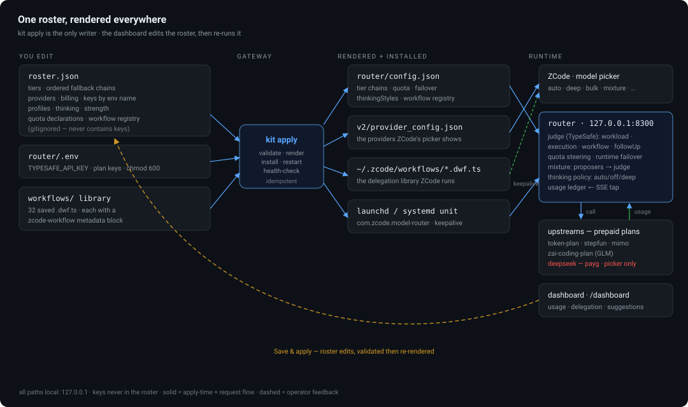

# zcode-router-kit

Installable, config-controlled model routing and workflow delegation for
[ZCode](https://github.com/zai-org/ZCode).

One roster file decides what a machine has; `kit apply` renders everything
ZCode reads. Clone the repo on a new machine, write its roster, set its keys,
and it comes up identical.

```
roster.json ──kit apply──┬── ~/.zcode/router/config.json      tier table, MoA, workflow registry
                         ├── ~/.zcode/v2/provider_config.json the providers the model picker shows
                         ├── ~/.zcode/workflows/*.dwf.ts       the delegation library
                         └── launchd / systemd service          keeps the router running
```

Requires Node ≥ 18 and nothing else. The router itself additionally needs
one npm dependency (`@typesafe-ai/sdk`), installed by `kit apply` into the
runtime dir when missing — that package is the judge that picks the workload,
the execution style, and the workflow for every `auto` request.

<p align="center">
  
</p>

## What you get

- **A model roster** — the plans this machine has (token plan, Step plan, MiMo
  plan, Z.AI coding plan, …), each with its endpoint, its models, and its key
  referenced by env-var name only. Keys live in `~/.zcode/router/.env`
  (chmod 600) and in ZCode's own provider config — never in the roster, never
  in git.
- **A workload tier table** — `quick` / `standard_code` / `hard` / `prose` /
  `deep_context`, each mapping a workload onto a concrete model, with ordered
  fallbacks. A machine missing a plan falls back to the next-best target
  instead of routing into a hole.
- **Pay-per-token safety** — a provider marked `billing: "payg"` can never be
  a routing target unless the roster explicitly sets `allowPayg: true`.
  Registering one for the picker is still allowed; billing it as the router's
  default is not.
- **Router-decided delegation** — the router (one TypeSafe judgment per task,
  cached) picks the workload, the execution style, and which saved workflows
  run, in what order. It answers three questions per task: run it as one call,
  as a **mixture of agents** (parallel proposers from different plan pools,
  judged, merged only when merging adds value), or as a **swarm** — a
  decomposed multi-agent run with review rounds, chosen from a library that
  includes swarm, adversarial-solve, bug-hunt, and review-sweep. The workflow
  registry is generated from the library's own `zcode-workflow` metadata
  blocks, so the library and the registry can never drift.
- **A workflow library** — the saved dynamic workflows in `workflows/`,
  installed into `~/.zcode/workflows/` without ever deleting files the user
  added locally.
- **A usage ledger + dashboard** — the router meters every upstream call
  (calls, errors, prompt/completion tokens, latency) per model and per day —
  losing mixture proposers included, because a prepaid plan pays for those
  too — and serves a local dashboard that shows the numbers and edits the
  roster.
- **Quota awareness & runtime failover** — declare a plan's allowance (or
  calibrate it against a console reading through the weighted ledger) and the
  router steers work toward the plan with headroom; a provider that answers
  quota-exhausted anyway is benched with a cooldown and the tier falls to its
  next candidate.
- **Thinking levels** — `auto` / `deep` / `off` per picker profile: force a
  provider's thinking mode on for hard problems, force it off for bulk
  delegation, or leave the judge to decide per task.

## New-machine quickstart

```bash
git clone git@github.com:adelvillar1/zcode-router.git zcode-router-kit && cd zcode-router-kit

# 1. a roster to edit — either the documented template or a copy of a live machine's
node bin/zcode-router-kit.mjs init --template      # or: kit init   (on the source machine, then commit roster.json)

# 2. the keys this machine has (names come from the roster)
node bin/zcode-router-kit.mjs env set XIAOMI_MIMO_API_KEY=… STEPFUN_API_KEY=…

# 3. render + install everything, then check it
node bin/zcode-router-kit.mjs apply --dry-run      # see exactly what would change
node bin/zcode-router-kit.mjs apply
node bin/zcode-router-kit.mjs doctor               # --live also probes each provider
```

Then in ZCode: run `LogModels` to confirm the roster appears, and pick
`auto-router/auto` (or a pin like `quick` / `hard` / `long-context`).

## Everyday use

```bash
kit status                 # what is installed, which tiers resolved, router health
kit doctor [--live]        # full verification of the whole chain; changes nothing
kit workflows list         # library, install state, and router-assignability per workflow
kit workflows sync         # copy the library into ~/.zcode/workflows
kit route "audit the docs tree for staleness"   # ask the running router for its verdict
kit apply                  # render + install + restart + health-check (idempotent)
kit upgrade                # git pull && kit apply
open http://127.0.0.1:8300/dashboard   # usage ledger, delegation editor, suggestions
```

## Configuring the roster

`roster.json` is the only file you edit by hand. Full documented example:
`templates/roster.defaults.json`.

**Providers** — what exists on this machine:

```json
"providers": {
  "xiaomi-mimo": {
    "baseUrl": "https://token-plan-sgp.xiaomimimo.com/v1",
    "apiKeyEnv": "XIAOMI_MIMO_API_KEY",
    "billing": "plan",
    "models": ["mimo-v2.6-pro", "mimo-v2.6-flash", "mimo-v2.5-pro", "mimo-v2.5"],
    "featured": ["mimo-v2.6-pro", "mimo-v2.6-flash"]
  },
  "zai-coding-plan": {
    "baseUrl": "https://api.z.ai/api/coding/paas/v4",
    "apiKeyEnv": "ZAI_CODING_API_KEY",
    "billing": "plan",
    "routerOnly": true
  }
}
```

`routerOnly` providers keep their key in the router's `.env` (they are not
registered in ZCode's picker); everyone else gets a provider-config entry
generated from the roster. `templateId` (no `baseUrl`) reuses a template the
app already knows, e.g. DeepSeek. `featured` sets `personalModelIds`; omit it
to expose every model.

**Capabilities the app can't infer** — context windows, reasoning knobs,
input formats:

```json
"manualModelRules": [
  { "providerId": "xiaomi-mimo", "modelId": "mimo-v2.6-pro",
    "config": { "enabled": true,
      "properties": { "contextWindow": 1000000, "inputFormat": { "supportsImage": true, "supportsVideo": true } },
      "optionSpecs": { "reasoningLevel": { "values": ["disabled", "enabled"] }, "maxOutputTokens": { "max": 131072 } } } }
]
```

**The judge** — `typesafe` controls the TypeSafe model that decides every
`auto` request (see [The judge is TypeSafe](#how-the-router-decides)):

```json
"typesafe": { "apiKeyEnv": "TYPESAFE_API_KEY", "model": "jev-1.13.0", "ttlHours": 6 }
```

**Tiers** — workload → model, with fallbacks for machines that lack a plan:

```json
"tiers": {
  "hard": { "target": "zai-coding-plan/GLM-5.3-Flash",
            "fallbacks": ["stepfun/step-5-preview", "xiaomi-mimo/mimo-v2.6-pro"] },
  "prose": { "target": "xiaomi-mimo/mimo-v2.6-flash", "fallbacks": ["token-plan/qwen3.8-flash"] }
}
```

A fallback fires when its target's provider has no key or is disabled in this
roster — never for quality reasons. Anything that fires is reported as a remap
(`kit status`, `kit apply`, `kit doctor`), so a degraded router is never silent.
`omniModel`, `wideModel`, and `mixture.aggregator` take the same treatment as an
ordered list (first is preferred):

```json
"omniModel": ["xiaomi-mimo/mimo-v2.6-pro", "zai-coding-plan/GLM-5.3-Flash"]
```

At runtime the whole usable chain travels with the tier: if the serving
upstream answers `402`/`403`/`408`/`429`/`5xx` — or the connection fails — the
router walks the remaining candidates in roster order and benches the failed
provider for a cooldown (429: 5 min, 402: 15 min, 403: 30 min, 5xx: 1 min;
a `Retry-After` header wins, `routing.failover.cooldowns` overrides).
Client-caused failures (400/404) pass through as-is. The response carries
`x-router-failover` when a walk happened, and the failed attempt plus the
winner are separate ledger rows.

`kit export` keeps the fallback chains and tier notes from the roster it
overwrites, since live state records only where each tier resolved to.
A provider marked `"billing": "payg"` is refused as a target unless you set
`allowPayg: true` — the router must not quietly start costing per-token money.

**Delegation** — picker profiles map onto tiers, and `mixture` fans a hard task
out to several proposers with a judge that integrates when merging adds value
(see [How the router decides](#how-the-router-decides)):

```json
"profiles": { "quick": { "workload": "quick" }, "vision": { "use": "omniModel" }, "mixture": { "use": "mixture" } },
"mixture": { "proposers": ["zai-coding-plan/GLM-5.3-Flash", "xiaomi-mimo/mimo-v2.6-pro", "stepfun/step-5-preview"],
             "aggregator": "zai-coding-plan/GLM-5.3-Flash", "proposerTimeoutMs": 240000 }
```

**Thinking levels** — a profile may carry `thinking: "auto" | "off" | "deep"`
(default `auto`, which strips reasoning params exactly as the router always
has). `deep` injects the provider's thinking-on param, `off` its thinking-off
param — which dialect each provider speaks comes from
`routing.thinkingStyles` (`"thinking"` for zai/mimo, `"enable_thinking"` for
token-plan/stepfun; known providers are pre-mapped). The roster ships two
profiles built on this: `deep` (hard tier, thinking on) and `bulk` (quick
tier, thinking off). Mind `max_tokens` — thinking tokens share that budget,
so a thinking-on call at a tiny cap returns empty content.

```json
"profiles": { "deep": { "workload": "hard", "thinking": "deep" },
              "bulk": { "workload": "quick", "thinking": "off" } },
"routing": { "thinkingStyles": { "my-provider": "thinking" } }
```

**Model strength (optional)** — the distribution suggester ranks models by
measured latency and errors, declared context, and quota headroom, but it
cannot know benchmark quality. `strength` (1–5, higher = stronger) is how you
tell it, and `hard`/mixture-aggregator suggestions sharpen accordingly.
Models without a declared strength rank neutral and the suggestion's
confidence drops — the panel says so rather than pretending:

```json
"strength": { "zai-coding-plan/GLM-5.3-Flash": 5, "xiaomi-mimo/mimo-v2.6-pro": 4 }
```

**Plan quota (optional)** — no plan provider exposes a quota API, so the
router derives what it can: the ledger meters weighted spend per provider
(off-peak hours count at their declared weight), a console reading — "the
plan is N% used" — is calibrated against that spend, and headroom drives
steering. Plans under 5% headroom are never suggested as primaries; the
suggester and the steering both leave undeclared providers alone. See
[Quota & steering](router/README.md#quota--steering) in the router README:

<p align="center">
  
</p>

```json
"providers": { "token-plan": { "quota": {
  "kind": "calendar", "allowance": 500000000,
  "calibration": { "reads": [{ "date": "2026-09-26", "pct": 23 }] },
  "offpeak": { "from": "00:00", "to": "08:00", "weight": 0.5, "tz": "Asia/Shanghai" },
  "source": "console, checked 2026-09-26" } } }
```

**Workflow assignment shapes** — one line per saved workflow describing the
problem shape that should route to it (auto-derived from the workflow's own
metadata when omitted):

```json
"workflows": { "shapes": { "swarm": "a large task that decomposes into several substantial independent parts…" },
               "registry": { "review-sweep": { "taskArg": "task", "defaults": { "base": "" } } } }
```

## How the router decides

<p align="center">
  
</p>

For an `auto` request the router makes **one judgment per task** — cached, so
an agentic tool loop keeps its model until you say something new. The judge
answers four questions at once, each gated over its own option space with its
own confidence threshold, so a weak pick in one cannot wipe a strong pick in
another:

| question | decides |
| --- | --- |
| `workload` | which tier: `quick` / `standard_code` / `hard` / `prose` / `deep_context` |
| `execution` | `single` / `mixture` / `swarm` |
| `workflow` | which saved workflow runs **first** (or none) |
| `followUp` | which **second** workflow runs after it (or none) |

**The judge is TypeSafe.** The decisions come from a TypeSafe Jev model reached
through the `@typesafe-ai/sdk` client — the same integration the
commissiontracker app uses, not local heuristics. Two distinct judgments exist.
The *task* judgment (4s timeout, no retries) sends only a compact state — your
latest instruction plus counters: message count, approximate input tokens,
attached images, tool definitions — and never the conversation or your files.
The *proposal* judgment (6s) runs only inside a mixture, asking which of the
parallel answers is best and whether merging them would beat the best one alone.

Every judgment is fail-open. A missing key, a thrown error, or confidence below
threshold each degrade to `defaultWorkload` as a single call, tagged in the log
as `judge:no-key`, `judge:error:…`, or `judge:low-confidence`. A TypeSafe outage
makes routing slower or lazier; it never fails a request.

The judge is also pluggable. `judge.mode` picks the backend: `typesafe` (the
default, as above), `fastino` (Fastino's hosted GLiNER2.5 encoder answers all
four questions in one forward pass — tens of milliseconds, no TypeSafe
dependency), or `cascade` (recommended: GLiNER2.5 first, TypeSafe escalates
when the encoder is cold, erroring, or below the confidence gates). Per-backend
counts land in the usage ledger so the handoff rate is measured, not assumed.
Details and the cold-start story: [router/README.md](router/README.md#judge-backends-typesafe--gliner25).

```json
"typesafe": { "apiKeyEnv": "TYPESAFE_API_KEY", "model": "jev-1.13.0", "ttlHours": 6 }
```

`apiKeyEnv` names the variable in `~/.zcode/router/.env` holding the key — the
key itself is never in the roster or in git. `model` is the judging model, and
`ttlHours` is how long a judgment is reused: it is cached per session, keyed on
a hash of the system prompt head plus your latest instruction, so an agentic
tool loop keeps one verdict across dozens of tool round-trips and the cache
(400 sessions, oldest evicted) cannot grow without bound.

Capability rules are checked before any judgment and always win: a request
carrying images goes to `omniModel`, and one wider than `wideChars` goes to
`wideModel`. A text-only target cannot take an image, and a small-context model
cannot swallow a million characters.

After the verdict, the tier's candidate chain is applied with quota awareness:
a candidate whose calibrated plan headroom is under
`routing.quotaMinHeadroom` (default 40%) is passed over for a healthier one in
the same chain, and if the serving upstream answers quota-exhausted anyway
(`402`/`403`/`429`/`5xx`) the walk continues to the next candidate while the
failed provider sits out a cooldown. The chosen profile's thinking policy is
applied to the forwarded call, and every attempt — successful, diverted, or
failed — lands in the usage ledger. Full mechanics:
[router/README.md](router/README.md).

**`single`** — one focused model call to the tier's target. The default for
ordinary work.

**`mixture` — mixture of agents.** For one hard question that does *not*
decompose into separate parts, the router fans the request out to
`mixture.proposers` in parallel, drawn from different plan pools and model
families so the answers actually differ. A TypeSafe judgment then picks the best
answer *and* decides whether merging adds value; `mixture.aggregator` runs only
when the judge says integration is warranted, so you never pay for a merge that
would average three answers into one mediocre one. Turns that carry tool
definitions skip mixture entirely — parallel proposals cannot be merged when
the turn is choosing tool calls mid-loop — and fall back to the hard tier,
logged as `+mixture-skipped-tools`.

**`swarm`** — the judge decided the request decomposes into several substantial
independent parts, or that quality depends on critique rounds. The router marks
the response `x-router-execution: swarm` and names the workflow to run; when
two stages are needed (first find the cause, then review the fix) it also names
a second workflow and hands it a stage-scoped prompt built from the first
stage's deliverable. The multi-agent execution itself lives in the workflow
library — which is why the library ships with the kit rather than beside it.

The library's fan-out workflows: `swarm` (decompose, build, review),
`adversarial-solve` (several plausible solutions argue, then get judged),
`bug-hunt` (root-cause something broken, without fixing it), `review-sweep`
(changes whose findings get confirmed before anyone acts), `deep-dive`,
`decision-memo`, `data-triage`, `regression-claim-verification`,
`coverage-push`, `migration`, `plan-backlog-generation`, `postmortem`. Of the
28 workflows in `workflows/`, 15 are assignable by the router; the rest take
structured arguments rather than a task and stay hand-launched.

**Asking the router directly** — `POST /route` (local token) returns the same
verdict without calling any model:

```json
{ "workload": "hard", "execution": "swarm", "target": null,
  "assignments": [{ "name": "swarm", "args": { "task": "…" } }],
  "assignment": { "name": "swarm", "args": { "task": "…" } },
  "conf": 0.82, "wfConf": 0.77, "reason": "judge" }
```

`target` is `null` on a mixture verdict (the caller does the fan-out);
`assignments` names the workflows in order. `kit route "…"` wraps the endpoint
for the shell.

Every response carries `x-router-execution`, `x-router-workload`, and
`x-router-workflow` headers, and the router logs `route`, `route-verdict`, and
`mixture` events to `logs/router.log` — so an unusual or degraded decision is
always visible after the fact.

## Adding a workflow

Drop the `.dwf.ts` file into `workflows/` and run `kit apply`. Its metadata
block supplies the description, the task argument, and (if you add the
shape) the routing entry. Nothing else to register.

## Safety model

- `kit apply` backs up `provider_config.json` before every write and refuses
  to write a schema it doesn't understand (`schemaVersion` must be 1). The
  app validates that file strictly: any violation degrades the whole personal
  config to account-only providers, so the merge is surgical — it rewrites
  only the keys the kit owns and leaves app-managed rules untouched.
- A keyless roster provider can never remove a working registration; removal
  is an explicit `enabled: false` in the roster.
- Pay-per-token providers are unreachable as routing targets unless the
  roster opts in.
- `kit apply --dry-run` writes nothing and prints the planned diff.

## Layout

```
roster.json                 this machine's roster (gitignored; contains no keys)
roster.json.example-style template: templates/roster.defaults.json
bin/, lib/                   the CLI (zero runtime dependencies)
router/server.js             the router itself (OpenAI-compatible proxy)
router/usage.mjs             the usage ledger + SSE metering tap
router/quota.mjs             quota derivation (calibration, headroom) and steering
router/suggest.mjs           the delegation-distribution suggester
router/dashboard.html        the local dashboard (usage, delegation editor, suggestions)
router/README.md             router internals: routing order, judgment, MoA, quota,
                             failover, thinking levels, logs
workflows/                   the delegation library (.dwf.ts files)
templates/roster.defaults.json       every roster field, documented
templates/systemd/                   the Linux user unit
docs/upstream-contribution.md        plan for contributing back to ZCode
```

## Known limits

- Routing is OpenAI chat-completions only.
- The judgment (TypeSafe Jev) adds ~1–3s to the first request of a task;
  subsequent requests in the same task are cache hits. A judge outage
  degrades to the default workload — it never fails a request.
- `kit` manages macOS launchd and Linux systemd user units; on other
  platforms it tells you how to run the router by hand.
- No artificial token limits are imposed anywhere; `routing.wideChars` only
  diverts payloads beyond a smaller model's window to a 1M-context model.
