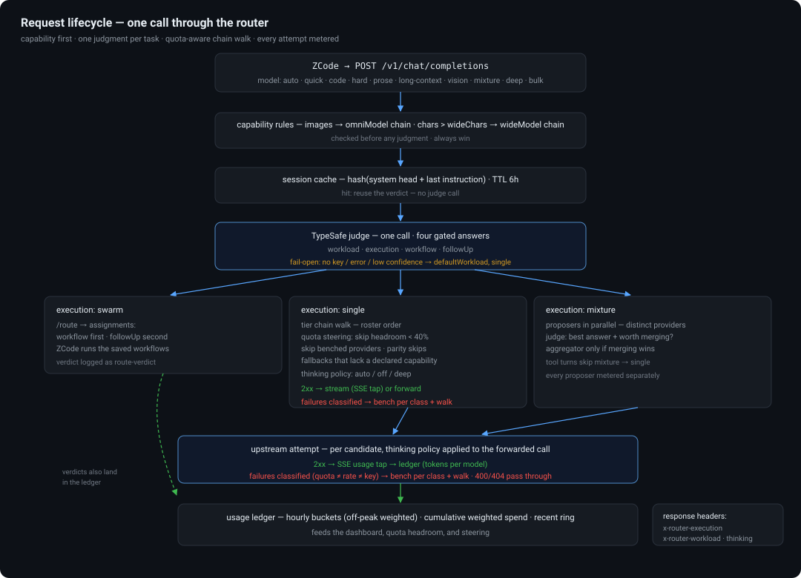
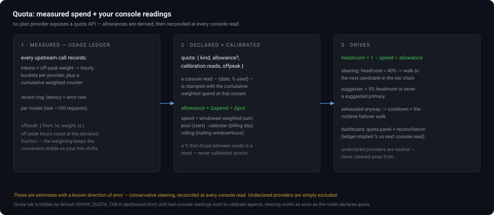

# zcode-model-router

Local OpenAI-compatible proxy that routes each task to the right upstream
model. Registered in ZCode as the **Auto Router** provider — its single
model, `auto`, appears in the model picker (`auto-router/auto`).

<p align="center">
  
</p>

## Routing

Per request, in order:

1. **Capability rules** (always evaluated, always win — even over a pinned
   profile):
   - Any image/video/audio content part -> `mimo-v2.6-pro` (omnimodal).
   - Payload larger than `routing.wideChars` (~150K tokens) -> same 1M-context
     flagship.
2. **Pinned profiles** — model ids other than `auto` pin their workload with
   no judgment:

   | Picker model | Pins to | Model | Plan |
   |---|---|---|---|
   | `quick` | quick | qwen3.8-flash | Token plan |
   | `code` | standard_code | step-3.7-flash | Step plan |
   | `hard` | hard | GLM-5.3-Flash | Z.AI Coding Plan |
   | `prose` | prose | mimo-v2.6-flash | MiMo plan |
   | `long-context` | deep_context | mimo-v2.6-pro | MiMo plan |
   | `vision` | (omni rule) | mimo-v2.6-pro | MiMo plan |

3. **`auto`** — one TypeSafe Jev judgment per *task* (cached, keyed on system
   prompt + latest user instruction, TTL `ttlHours`) picks the workload:

   | Workload | Signals in the judge | Model | Plan |
   |---|---|---|---|
   | `quick` | quick answers, tiny edits, formatting, simple extraction | qwen3.8-flash | Token plan |
   | `standard_code` | routine features, normal debugging, tool work | step-3.7-flash | Step plan |
   | `hard` | architecture, intricate reasoning, big refactors, subtle bugs | GLM-5.3-Flash | Z.AI Coding Plan |
   | `prose` | docs, prose, summaries, explanations, reports | mimo-v2.6-flash | MiMo plan |
   | `deep_context` | connecting many files, very long documents | mimo-v2.6-pro | MiMo plan |

   Confidence below `routing.minConfidence` (0.6), missing key, or any judge
   error -> `routing.defaultWorkload` (standard_code). A TypeSafe outage never
   fails a request.

### Topology: who decides swarm vs single

The TypeSafe judgment answers TWO questions per task: the workload (which
model) and the **execution style** — `single` (one focused call/worker),
`mixture` (parallel answers + judge), or `swarm` (decomposed multi-agent work
with critique rounds). Topology is a routing decision, not a hardcoded one.
Hardness alone does not trigger MoA: a single hard decision stays `single`.

Consumers:
- The **chat path** acts on it: mixture/swarm verdicts run MoA and return the
  verdict in the `x-router-execution` / `x-router-workload` response headers
  (a swarm verdict at the chat layer runs MoA as its closest available
  approximation and advertises the recommendation for orchestration).
- **`POST /route`** ({task} or {messages}) returns the verdict alone —
  `{workload, execution, target, conf, reason}` — for delegation-time
  decisions (launch the swarm workflow vs normal delegation).

### Workflow assignment (and sequencing)

`routing.workflows` registers every saved workflow with a one-line problem
shape. The TypeSafe judgment then answers four questions per task: the
workload (which model), the execution style (single/mixture/swarm),
**which saved workflow runs first**, and **which runs second** — plus a follow-up pick for requests that
complete only after a second workflow (research then write it up, diagnose
then review the fix). `POST /route` returns `workload`, `execution`, `target`, `assignments: [{name, args}]`
(in order), `assignment` (the first step, for convenience), `conf`, `wfConf`,
and `reason` — the router picks, the coordinator assigns and runs them in
sequence, feeding each workflow's deliverable forward. A workflow assignment
outranks the chat layer's mixture approximation; `execution` governs what the
chat path itself does. Note `wfConf` on an empty `assignments` is confidence
in the *"none"* abstention — gate on `assignments` being non-empty, not on the
number alone.

Confidence gates are per-question (`minConfidence` for the 5-way workload
pick, `workflowMinConfidence` default 0.4 for the 12-way workflow pick —
different option spaces, different chance baselines). Registered shapes:

swarm, review-sweep, bug-hunt, migration, research-report, deep-dive,
coverage-push, content-production, decision-memo, postmortem,
adversarial-solve. Tuning a mis-pick is a one-line shape edit in config.json.

### Mixture of Agents (`mixture` / `auto` + hard)

Really hard, one-shot reasoning (no tool-calling — tool turns can't be
merged) fans out to 3 proposers on 3 different plan pools and model families:

1. **Propose** — `GLM-5.3-Flash`, `mimo-v2.6-pro`, `step-5-preview` answer the
   same request in parallel (`routing.mixture.proposers`).
2. **Evaluate** — one TypeSafe Jev call picks the best answer (`best_answer`
   Choice with calibrated probabilities) AND decides integration
   (`worth_merging` Noul: "would merging produce a better answer than the
   single best alone?").
3. **Integrate if needed** — when the judge says merging adds value, the
   aggregator (`GLM-5.3-Flash`) synthesizes one answer from all proposals;
   otherwise the winning proposal is returned verbatim.

`auto` routes to MoA when the workload is `hard` and the request carries no
tools; the `mixture` picker profile pins it directly. Every run logs the
proposers, the winner, its confidence, and whether merging happened
(`event: "mixture"`).

No artificial limits: client `max_tokens` passes through verbatim (or is
unset so each model uses its own output default — these models run 1M input
contexts and 128K+ outputs), and judge/aggregator inputs are never truncated.
`routing.wideChars` (1,000,000) only exists to divert payloads beyond the
262K-token windows of qwen3.8-flash / step-3.7-flash to the 1M-window models.

All routed upstreams draw on prepaid plans (Z.AI Coding Plan, token plan,
step plan, MiMo plan) — there is no per-token-billed upstream in the chain.
The `/api/coding/paas/v4` path is the Z.AI coding plan's own API surface
(plan quota, never pay-per-token); the pay-per-token endpoint `/api/paas/v4`
is deliberately unused. ZCode's
`~/.zcode/v2/provider_config.json` stays the single source of truth for
upstream URLs and keys (except `zai-coding-plan`, whose key lives in `.env`)
— the proxy re-reads it automatically when it changes.

## Dashboard

The router serves its own management UI at **`http://127.0.0.1:8300/dashboard`**
— no app patching, survives ZCode updates, identical on every machine the kit
installs on. The page is static and carries no secrets; its API calls use the
same local token as the proxy routes (asked for once, kept in the browser's
localStorage — `kit status` prints it).

- **Thinking levels** — profiles can carry `thinking: "auto" | "off" | "deep"`
  (default auto). The roster ships two new picker profiles around this:
  `deep` (hard tier, thinking forced on — for the problems that deserve the
  reasoning budget) and `bulk` (quick tier, thinking forced off — for bulk
  delegation where reasoning tokens are pure waste). `auto` strips reasoning
  params as before. Providers speak different dialects, so
  `routing.thinkingStyles` maps providerId → param style: `thinking`
  ({type: enabled|disabled} — zai, mimo), `enable_thinking` (qwen-style —
  token-plan, stepfun), `reasoning_effort`, or `none` (strip only). Known
  providers are pre-mapped; the applied level rides the response as
  `x-router-thinking` and lands in the ledger's recent rows. Mind the budget:
  thinking tokens come out of the same `max_tokens`, so a thinking-on call at
  a tiny cap returns empty content — the ledger shows those as calls with
  unknown/short completions.
- **Suggest distribution** — the Delegation tab can propose a complete
  delegation distribution from the roster plus the measured ledger: which
  model serves each workload tier (with fallback order), the omni/wide
  capability chains, and the mixture proposers/aggregator. Each row shows
  current → suggested with a reason and a confidence chip, and nothing is
  applied until you push the suggestion into the editor and run Save & apply.

  The scorer is deterministic and its inputs are published per row: measured
  p50 latency and error rate from the recent-request ring, declared context
  window and multimodal support (from the roster's manual model rules),
  calibrated quota headroom, and an optional per-model `strength` (1–5).
  Weighting differs per objective — `quick` is latency-dominated, `hard` is
  strength-dominated, `deep_context` floors on declared context. What the
  scorer cannot know is benchmark quality: models without a declared strength
  rank neutral, which is why confidence drops to low/medium for tiers with
  thin call data, and why declaring `strength` in the roster is the way to
  sharpen it. Payg providers are excluded unless `allowPayg` is on, plans
  under 5% headroom are never suggested as primaries, and mixture proposers
  are drawn from distinct providers so errors don't correlate. Router-only
  providers (empty `models[]`) are scored from the pairs the live config
  actually routes.


Four surfaces:

- **Usage** — the point of the router is that plans are prepaid, so the
  interesting number is what each model actually consumed. Calls, errors,
  prompt and completion tokens per model (including losing mixture proposers
  and the aggregator — a prepaid plan pays for those all the same), per-day
  rollups, the single/mixture/swarm delegation mix, judge freshness
  (fresh TypeSafe judgments vs session cache hits), and the last 100 routed
  requests with latency and tokens. Tokens are recorded only when the upstream
  reported them — nothing is estimated, and a model that never reports usage
  shows calls with unknown tokens rather than invented numbers. Counters live
  in `logs/usage.json`, survive deploys and restarts, and are never written on
  the request path (flushed a few seconds after the last change).
- **Delegation** — a structured editor for the roster's routing table:
  workload tiers with their fallback chains, the omni/wide capability chains,
  mixture proposers and aggregator, judge thresholds, and the picker profiles.
  Each tier shows what the router resolved *right now*, so a fallback remap is
  visible instead of silent.
- **Providers** — enable/disable, billing plan/payg, whether the key resolves.
  Keys themselves are env-var references by design; set them with `kit env
  set`, never in the UI.
- **Workflows** — the delegation registry, and a control rather than a
  catalog: per workflow, the shape text the judge matches against (roster-owned
  and authoritative over the workflow's own frontmatter), assignability with
  the task argument the router fills, arg defaults, and live assignment
  outcomes (first stage vs follow-up, last assigned) — the only place those
  numbers exist. ↺ drops an override so the value falls back to library
  derivation. **Authoring stays in ZCode**: workflows are `.dwf.ts` files in
  `~/.zcode/workflows/` created via CreateWorkflow; this tab tunes assignment,
  never the workflow code.

Save & apply writes the roster and then runs the kit's own `kit apply
--only router,provider` — validation, the payg guard, config regeneration and
the provider_config merge all happen through the reference pipeline, never a
second copy inside the router. If apply fails, the roster is rolled back and
resynced before the error reaches the UI. Two fields are not dashboard-editable
on purpose: the router identity (`port` / `localToken`) — changing the port
there would desync the running service definition — and the schema version.

## Judge backends (TypeSafe / GLiNER2.5)

The four routing questions (workload, execution style, workflow, follow-up)
can be answered by either of two backends, picked with a roster block:

```json
"judge": {
  "mode": "cascade",             // typesafe (default) | fastino | cascade
  "fastino": {
    "baseUrl": "http://127.0.0.1:8400",
    "apiKeyEnv": "SYS1_BEARER_TOKEN",
    "provider": "local",
    "timeoutMs": 2500
  }
}
```

- `typesafe` — the default, unchanged: TypeSafe Jev answers all four
  questions, 1–3s on the first request of a task, then cached.
- `fastino` — **served by [sys1](https://github.com/adelvillar1/sys1)**, the
  standalone decision-model library that owns the one fastino integration.
  The router POSTs the four questions to the sys1 service's `/v1/classify`
  as an inline `task_spec` built from this install's own workload/workflow
  names, and sys1's `local` provider runs `fastino/GLiNER2.5-Decide` through
  the vendor-prescribed classification API (gliner2.classification: one
  decode for all four questions, full probabilities, confidence = max).
  Local, offline, no vendor API key; ~150–400ms per judgment through a
  running classifier server. Run the sys1 service (`uvicorn service.main:app
  --port 8400`) plus its classifier server (`service/classifier_server.py`
  inside the gliner venv; see sys1's README "Serving the local fastino
  wire"). `apiKeyEnv` names the bearer-token variable in the router .env —
  omit it for a token-less service. Set `task` to a registered sys1 task
  name to skip the inline spec.
- `cascade` — the recommended mode: GLiNER2.5 first, and TypeSafe escalates
  whenever the encoder errors, is unreachable, or sits below the confidence
  gates. Escalations are counted separately so the handoff stays visible.

Three operational facts shape this:

- **Cold starts are gone.** The encoder runs locally and stays loaded (the
  old hosted path answered HTTP 425 `model_warming` for minutes; that story
  is history). The 150s keep-alive ping is now a harmless health probe —
  set `judge:fastino.keepWarm: false` to silence it.
- **The mixture's best-answer judge stays TypeSafe** in every mode. Comparing
  three long answers for correctness is reasoning work; a 340M encoder
  ranking them would be a quality risk for the marquee feature.
- **Privacy posture improves with the backend.** Both backends receive the
  latest instruction text plus counters, never the conversation or files —
  and with `fastino` or `cascade`, that instruction now stays on the local
  sys1 service instead of going to a vendor API.

Per-backend judgment counts land in the ledger and show on the Usage tab
(`typesafe · fastino · escalated`), so the cascade's handoff rate is visible,
not assumed.

Escalations are also *reconciled*: on every escalation TypeSafe answers too,
so the two opinions are compared per question and shown on the Usage tab's
Cascade reconciliation panel — agreement/disagreement/gate-rejected/abstained
percentages, plus a history of disagreements (which model picked what, with
GLiNER's confidence). The label on the panel states the sampling bias
outright: escalations are exactly the requests where GLiNER was least
confident, so this measures agreement among its hardest cases, not overall
accuracy. Reading it honestly takes two numbers: a high disagreement rate
here says the fast path needs recalibration; a low one says the encoder is
holding up on the cases that were hard for it.

## Quota & steering


<p align="center">
  
</p>

No plan provider exposes a quota API (probed: no rate-limit headers, no balance
endpoints — deepseek's documented `GET /user/balance` is the one exception, and
it is payg-blocked anyway). So quota is **derived locally**: the ledger
measures weighted spend per provider, and the roster declares the rest.

```jsonc
"providers": {
  "token-plan": {
    "quota": {
      "kind": "pool",                  // pool | calendar | rolling
      "start": "2026-09-01",           // pool: provisioned date; calendar: billing anchor
      "windowHours": 24,               // rolling only
      "allowance": 500000000,          // optional if calibrating
      "calibration": {
        "reads": [ { "date": "2026-09-26", "pct": 23 } ]   // what the console says
      },
      "offpeak": { "from": "00:00", "to": "08:00", "weight": 0.5, "tz": "Asia/Shanghai" },
      "source": "console, checked 2026-09-26"
    }
  }
}
```

- **Weighted spend** — the ledger keeps hourly buckets per provider, and every
  call's tokens are counted at their off-peak weight at record time. The
  cumulative weighted counter is the numerator for everything below.
- **Calibration** — the console reading is the ground truth; the ledger is the
  conversion. A read stamped with the cumulative weighted spend at that
  instant (the dashboard does this automatically) turns any two reads into an
  allowance estimate: `Δweighted-spend ÷ Δ%`. The latest pair wins, earlier
  pairs show a stability spread, and a percentage that drops between reads
  (a quota reset) is never calibrated across. Reads entered on the Quota tab
  are stamped for you; reads hand-added to the roster older than yesterday are
  excluded from pair calibration.
- **Steering** — apply embeds each tier's full usable candidate chain, and the
  router walks it: first candidate whose headroom (1 − spend/allowance) is at
  or above `routing.quotaMinHeadroom` (default 0.4) wins. Providers without a
  declaration are neutral — steering never diverts away from what is unknown.
  If every declared candidate is under pressure, the max-headroom one wins.
  Steering only ever reorders a tier's own chain, is logged as `quota-steer`,
  and shows in the ledger as `quota:steered`. Capability chains steer on the
  same rules (every candidate in them is omni/wide-capable by construction);
  mixture executions are exempt.
- **Runtime failover & cooldowns** — quota steering reacts to declared
  headroom before a call; failover covers the case where the provider answers
  "no" anyway. A 402/403/408/429/5xx (or a network error) from the serving
  upstream walks the rest of the tier's candidate chain in roster order —
  the chain *is* the capability-proximity ranking, so "closest model in the
  roster" is exactly what it tries next. The failed provider is benched for a
  status-dependent cooldown (429: 5 min, 402: 15 min, 403: 30 min, 5xx and
  network errors: 1 min; a `Retry-After` header on 429/503 wins within an
  hour cap, and `routing.failover.cooldowns` overrides any entry), during
  which steering and the failover walk both skip it. Failovers are logged as
  `attempt: N` on the route line and `failover:N` in the ledger, and the
  client sees `x-router-failover` on the response. Client-caused failures
  (400/404) are surfaced as-is — every other candidate would fail them too.
  Capability chains (omni/wide) fail over on the same rules; a failure that
  exhausts the whole chain surfaces as a 502 naming the workload and the last
  status, so the roster can be fixed.

- **The dashboard's Quota tab** shows each declared provider's headroom bar,
  spend vs allowance in weighted router-tokens, the off-peak schedule, the
  ledger-implied percentage versus the last console reading, and a one-field
  entry for the next console read. Providers without a declaration are listed
  as neutral.

Every number here is an estimate with a known direction of error — the point
is bounded, visible, soft-failing approximation, not billing-grade truth.

## Files

- `server.js` — the proxy (Node ≥ 18, one npm dep: `@typesafe-ai/sdk`).
- `usage.mjs` — the usage ledger and the SSE tap that meters streams without
  altering a byte.
- `quota.mjs` — off-peak weighting, calibration math, headroom derivation, and
  the steering rule.
- `dashboard.html` — the UI above, served at `/dashboard`.
- `config.json` — port, local token, tier table (with each tier's full usable
  candidate chain), thresholds. **Generated from
  the roster** (`kit apply`), so hand-edits are overwritten — edit the roster
  or use the dashboard instead. Re-read on mtime change; a restart is only
  needed for code changes.
- `.env` — `TYPESAFE_API_KEY` (chmod 600; copied from the hermes agent env).
- `logs/router.log` — one JSON line per request: tier, upstream model,
  reason (`capability:*` / `judge` / `cache` / `judge:low-confidence` /
  `quota:steered`), confidence, sizes, upstream status, latency, plus
  `quota-steer` events.
- `logs/usage.json` — the usage ledger the dashboard renders (hourly buckets,
  weighted cumulative counters included).

## Operations

Runs as a launchd user agent:
`~/Library/LaunchAgents/com.alejandrodelvillar.zcode-model-router.plist`
(RunAtLoad + KeepAlive, listens on 127.0.0.1:8300 only).

```bash
launchctl kickstart -k gui/$(id -u)/com.alejandrodelvillar.zcode-model-router  # restart
launchctl bootout gui/$(id -u)/com.alejandrodelvillar.zcode-model-router       # stop
curl -s http://127.0.0.1:8300/healthz                                          # health
open http://127.0.0.1:8300/dashboard                                           # usage + roster UI
tail -f ~/.zcode/router/logs/router.log                                        # watch routing
```

To retarget any workload, profile or chain, edit the roster (`roster.json` in
the kit) or the dashboard's Delegation tab — never `config.json` by hand.
Tier targets fall down their chain when a provider is disabled, its key is
missing, or it bills per token while `allowPayg` is off, and `kit apply`
refuses a roster whose tiers have no usable target at all.

## Known limits

- Routing is OpenAI chat-completions only; the Z.AI coding-plan models
  (GLM-5.3-Flash etc.) speak the Anthropic wire format and are not router
  targets yet — they'd need an Anthropic-messages translation hop.
- Judgments add ~1–3s to the first request of a task; subsequent requests in
  the same task are cache-hits with zero added latency.
